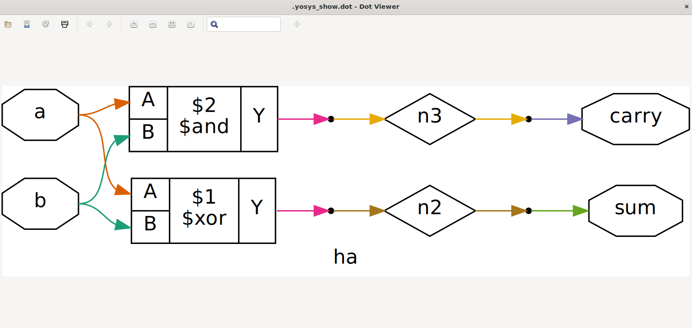
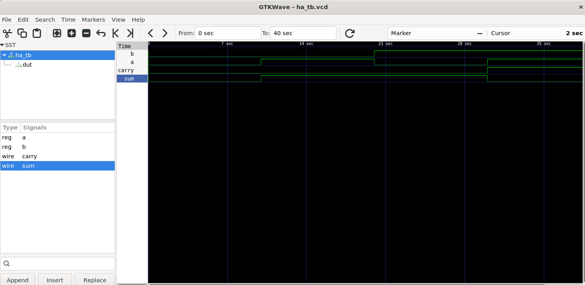

# Half Adder VHDL – Simulation, Conversion, and Synthesis

This README explains how to work with the Half Adder (HA) design using **IIC-OSIC-TOOLS**, including simulation in GTKWave, conversion to Verilog, and gate-level synthesis with Yosys.

---

## 🔬 View in GTKWave using IIC-OSIC-TOOLS

Clone the following files into your working directory:
```
├── ha.vhdl
├── ha_tb.vhdl
```

### ✅ Step-by-step:

```bash
# Check for syntax errors
ghdl -s ha.vhdl
ghdl -s ha_tb.vhdl

# Analyze the code
ghdl -a ha.vhdl
ghdl -a ha_tb.vhdl

# Elaborate the design
ghdl -e ha_tb

# Run the simulation
ghdl -r ha_tb

# Generate a VCD (waveform) file
ghdl -r ha_tb --vcd=ha.vcd

# Open the waveform in GTKWave
gtkwave ha.vcd
```

In GTKWave, add signals of interest to the timeline, and use `Ctrl + Scroll` to zoom.

---

## 🔁 Convert VHDL to Verilog

You can use GHDL to convert VHDL into Verilog:

```bash
ghdl -a ha.vhdl
ghdl synth --out=verilog ha > ha_synth.v
```
Now you will find the ha_synth.v is generated in directory. you can view it using the command `less ha_synth.v`
---

## ⚙️ Gate-Level Synthesis with Yosys

type below command

```bash
yosys
```

Inside Yosys, run the following commands:

```tcl
# Read the synthesized Verilog
read_verilog ha_synth.v

# Convert behavioral logic into RTL
proc

# Optional: visualize the current state,
show -colors 3
```
After running one can see the netlist as shown below.



---
In the results folder, there is a ha_tb.v file which I wrote for simulation. 

Then we check the wave to verify if they are matching we can use the following commands

```
iverilog -o ha_tb.vvp ha_tb.v ha_synth.v

vvp ha_tb.vvp

gtkwave ha_tb.vvp

```



I have also included .vcd file

---
